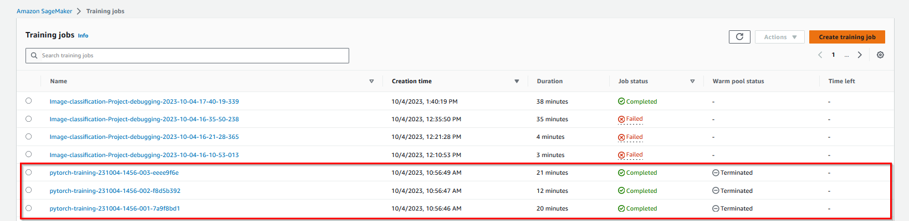
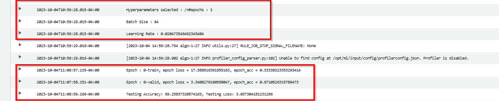
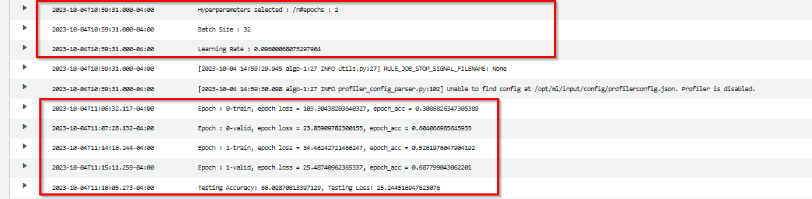
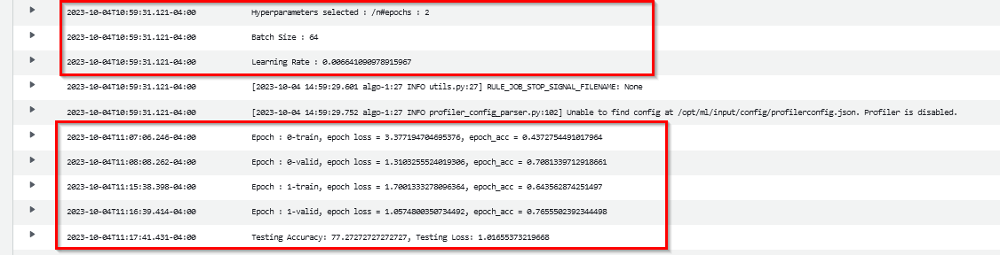
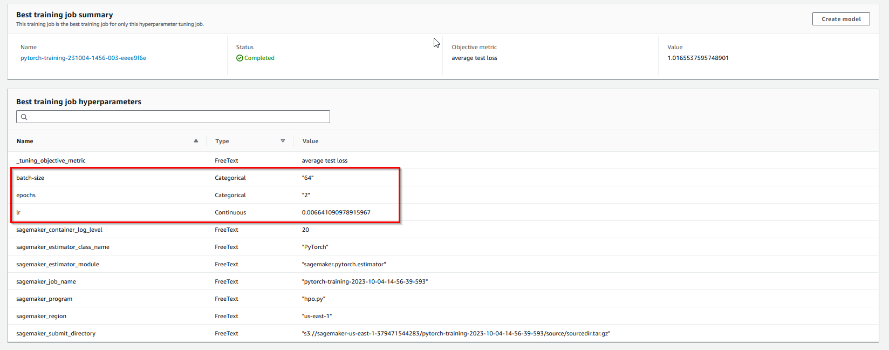

# Image Classification using AWS SageMaker

Use AWS Sagemaker to train a pretrained model that can perform image classification by using the Sagemaker profiling, debugger, hyperparameter tuning and other good ML engineering practices. This can be done on either the provided dog breed classication data set or one of your choice.

## Project Set Up and Installation
Enter AWS through the gateway in the course and open SageMaker Studio. 
Download the starter files.
Download/Make the dataset available. 

## Dataset
The provided dataset is the dogbreed classification dataset which can be found in the classroom.
The project is designed to be dataset independent so if there is a dataset that is more interesting or relevant to your work, you are welcome to use it to complete the project.

### Access
Upload the data to an S3 bucket through the AWS Gateway so that SageMaker has access to the data. 

## Hyperparameter Tuning
What kind of model did you choose for this experiment and why? Give an overview of the types of parameters and their ranges used for the hyperparameter search

In this experiment we are using ResNet50 pretrained model for image classification. The types and ranges of parameters hyperparameters used are as below:
    lr: ContinuousParameter range between 0.001- 0.1
    batch-size: (32, 64, 128)
    epochs: (1, 2)
    
    
Remember that your README should:
- Include a screenshot of completed training jobs

Best Parameters



- Logs metrics during the training process

Job 1


Job 2


Job 3


- Tune at least two hyperparameters
```
hyperparameter_ranges = {
    "lr": ContinuousParameter(0.001, 0.1),
    "batch-size": CategoricalParameter([32, 64, 128]),
    "epochs": CategoricalParameter([1, 2])
}
```

- Retrieve the best best hyperparameters from all your training jobs

Best Parameters


## Debugging and Profiling
**TODO**: Give an overview of how you performed model debugging and profiling in Sagemaker

For debugging and profiling, we chose to monitor Loss Not Decreasing rule during debudding and ProfilerReport was used to generate a report with stats about the training job. We also had to create a hook using the smdebug package and it can be seen in use within the train_model.py 

Added the below query:
```
rules = [ 
    Rule.sagemaker(rule_configs.loss_not_decreasing()),
    ProfilerRule.sagemaker(rule_configs.ProfilerReport())
]
```


### Results
**TODO**: What are the results/insights did you get by profiling/debugging your model?

It took around 36mins to run the model. The GPU was under utlizied because of low number of batchsize, could have saved the extra computing power by using a different approch or using a small instance, or increasing the batch size.

**TODO** Remember to provide the profiler html/pdf file in your submission.


## Model Deployment
**TODO**: Give an overview of the deployed model and instructions on how to query the endpoint with a sample input.
```
cwd = os.getcwd()
path = os.path.join(cwd, "test/001.Affenpinscher/Affenpinscher_00047.jpg")
pil_img = Image.open(path)

preprocess = T.Compose([
   T.Resize(256),
   T.CenterCrop(224),
   T.ToTensor(),
   T.Normalize(
       mean=[0.485, 0.456, 0.406],
       std=[0.229, 0.224, 0.225]
   )
])

image = preprocess(pil_img).unsqueeze(0)
```
This query will load the image from the path and transform it. Further, we use the predictor to predict the image
```
response = predictor.predict(image)
```

**TODO** Remember to provide a screenshot of the deployed active endpoint in Sagemaker.


